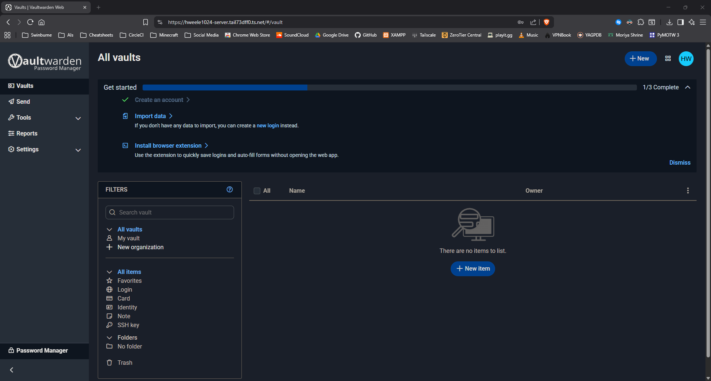

# Self-hosted Bitwarden on Headless Linux Server for free (Ubuntu/Debian)
A guide to set up private Bitwarden password manager for free using Vaultwarden, Docker, Docker Compose v2, Caddy and Tailscale; the service is accessible from anywhere on any compatible devices as long as the server is on and paid domains and port forwarding are also not required.

*This guide is functional but still work in progress and more info/details will be added in the the future, for any questions see [FAQ](#faq) section.*



## Table of Contents
- [Setup](#setup)
- [Configuration](#configuration)
- [Usage](#usage)
- [Maintenance](#maintenance) (WIP)
- [Troubleshooting](#troubleshooting) (WIP)
- [FAQ](#faq)
- [License](#license)
- [Acknowledgments](#acknowledgments)
- [Additional Resources](#additional-resources) (WIP)

## Setup
### 1. Make sure packages are up to date
```
sudo apt update && sudo apt upgrade -y
```

### 2. Install Docker and Docker Compose v2
```
# Install Docker (includes Compose v2)
curl -fsSL https://get.docker.com -o get-docker.sh
sudo sh get-docker.sh

# Add your user to docker group
sudo usermod -aG docker $USER

# Verify installation
docker --version
docker compose version
```
⚠️ Important: Log out and back in for group changes to take effect.

### 3. Install and Configure Tailscale
```
# Install Tailscale
curl -fsSL https://tailscale.com/install.sh | sh

# Start Tailscale and authenticate
sudo tailscale up
```
After Tailscale is installed it will provide an authentication link, follow it and sign up/log in to your Tailscale account.

#### Enable MagicDNS in Tailscale
1. Visit https://login.tailscale.com/admin/dns
2. Make sure that MagicDNS is ON (If its not then toggle it to ON)
3. Your server will get a hostname like `your-server-name`

#### Or you can check your hostname via Terminal using:
```
# Both works fine
tailscale status
hostname
```
Save your hostname (e.g., `your-server-name`) - you'll need it for configuration.

### 4. Create Project Directory
```
# Create directory structure (/srv is used as example for 
# mounted drive, you can use any drive or directory you want)
sudo mkdir -p /srv/vaultwarden/data

# Set ownership
sudo chown -R $USER:$USER /srv/vaultwarden

# Navigate to directory
cd /srv/vaultwarden
```

### 5. Create Configuration Files
#### In your `/vaultwarden` directory create `compose.yaml`:
```
nano compose.yaml
```
You will need a CLI text editor like `nano` or any  other alternatives

#### Add the following (replace `YOUR-HOSTNAME` with your Tailscale/Server hostname):
```
services:
  vaultwarden:
    image: vaultwarden/server:latest
    container_name: vaultwarden
    restart: always
    environment:
      - WEBSOCKET_ENABLED=true
      - SIGNUPS_ALLOWED=true
      - DOMAIN=https://YOUR-HOSTNAME
    volumes:
      - ./data:/data
    networks:
      - vaultwarden-network

  caddy:
    image: caddy:latest
    container_name: caddy
    restart: always
    ports:
      - "80:80"
      - "443:443"
    volumes:
      - ./Caddyfile:/etc/caddy/Caddyfile
      - ./caddy-data:/data
      - ./caddy-config:/config
    networks:
      - vaultwarden-network

networks:
  vaultwarden-network:
    driver: bridge
```
Save and exit by pressing `Ctrl + X` then `Y` then `Enter` if you are using `nano`

#### In your `/vaultwarden` directory create `Caddyfile`:
 ```
 nano Caddyfile
 ```

#### Add (replace `YOUR-HOSTNAME`):
```
YOUR-HOSTNAME {
    tls internal
    reverse_proxy vaultwarden:80
}
```
Remember to save and exit

### 6. Start Services
```
# Start containers
docker compose up -d

# Verify containers are running (if needed)
docker compose ps

# Check logs (if needed)
docker compose logs -f
```

## Configuration
### 1. Access Vaultwarden
1. Install Tailscale on your device (phone, laptop, etc.)
2. Connect to Tailscale
3. Open browser and navigate to: https://YOUR-HOSTNAME
4. Accept the security warning (self-signed certificate)
5. Create your Bitwarden account

#### Disable Signups (After Account Creation)
```
cd /srv/vaultwarden
nano compose.yaml
```

#### Change `SIGNUPS_ALLOWED=true` to `SIGNUPS_ALLOWED=false`:
```
    environment:
      - WEBSOCKET_ENABLED=true
      - SIGNUPS_ALLOWED=false  # Changed
      - DOMAIN=https://YOUR-HOSTNAME
```

#### Restart
```
# Both works fine
docker compose restart vaultwarden

docker compose down
docker compose up -d
```

### Optional: Enable Admin Panel 
#### Generate Admin Token:
```
openssl rand -base64 48
```

#### Add to `compose.yaml`:
```
    environment:
      - WEBSOCKET_ENABLED=true
      - SIGNUPS_ALLOWED=false
      - DOMAIN=https://YOUR-HOSTNAME
      - ADMIN_TOKEN=your-generated-token # Replace your token here
```
Restart and access at: https://YOUR-HOSTNAME/admin

### Set Up Automatic Backups
This section is work in progress

### Usage
#### Web Interface
Access from any browser on a Tailscale-connected device: https://YOUR-HOSTNAME

#### Mobile Apps (Phone/Tablet)
1. Install official Bitwarden app
2. Tap settings icon (⚙️) on login screen
3. Enter server URL: https://YOUR-HOSTNAME
4. Log in

#### Desktop Apps
1. Install Bitwarden desktop app
2. Settings → Account → Server URL
3. Enter: https://YOUR-HOSTNAME
4. Log in

#### Browser Extensions
1. Install Bitwarden extension
2. Extension settings → Server URL
3. Enter: https://YOUR-HOSTNAME
4. Log in

### Maintenance
This section is work in progress

### Troubleshooting
This section is work in progress

## FAQ
### Q: Why is Caddy used?
> A: Due to Bitwarden (Vaultwarden) being very strict/secure; basically, even though Vaultwarden runs on plain HTTP (port 80) it won't allow http://your-server-ip to access its web interface because modern browsers require HTTPS for security features like the Web Crypto API (which Bitwarden needs to encrypt passwords); so Caddy is used for enabling HTTPS. 

### Q: Why is Tailscale used?
> A: For some reason `your-server-ip` (ipv4) format doesn't work with the Caddyfile (when i tried to config it myself at least) so we use our Tailscale address instead and since Tailscale is needed to make Bitwarden accessible on anywhere by bypassing port forwarding anyway.
 
### Q: Do I need to install Tailscale on every device?
> A: Yes, any device accessing Vaultwarden needs Tailscale installed and connected.

### Q: What if my server's IP changes?
> A: Tailscale handles this automatically - your hostname stays the same.

### Q: Is this free?
> A: Yes! All components (Vaultwarden, Tailscale, Caddy, Docker) are free for personal use.

### Q: Can I use this for other people?
> A: Yes, other accounts need to be created before disabling signups, or use organizations feature.

### Q: Can I access this without Tailscale?
> A: Not with this setup. For public access, you'd need port forwarding or services like Cloudflare Tunnel with a domain which costs money and is very complex to set up.

### Q: How do I uninstall everything?
> A: 
```
cd /srv/vaultwarden
docker compose down -v
cd ..
sudo rm -rf vaultwarden
```

### Q: Why is Port Forwarding not used?
> A: This is more of a personal question, my ISP blocks Port Fowarding via CGNAT on my router for some reason and it would take forever for them to respond to me and disable it if i ever contact them (I'd tried it and no, I can't change my ISP since I'm broke 😞, that's why this entire setup is free)

## License
- This guide is free to use for personal, experimental and educational purposes.

## Acknowledgments
- [Bitwarden](https://bitwarden.com/) - Open-source password manager
- [Vaultwarden](https://github.com/dani-garcia/vaultwarden) - Unofficial Bitwarden server
- [Docker](https://www.docker.com/) - Software Container
- [Docker Compose v2](https://docs.docker.com/compose/) - YAML configuration for Docker containers
- [Caddy](https://caddyserver.com/) - Automatic HTTPS server
- [Tailscale](https://tailscale.com/) - Zero-config VPN


## Additional Resources
This section is work in progress