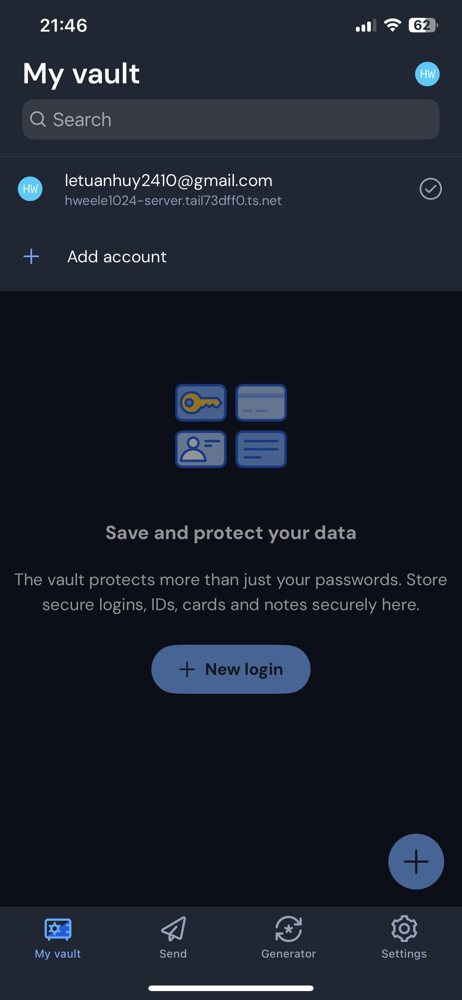

# Self-hosted Bitwarden on Headless Linux Server for free (Ubuntu/Debian)
A guide to set up private Bitwarden password manager for free using Vaultwarden, Docker, Docker Compose v2, and Tailscale; the service is accessible from anywhere on any compatible devices as long as the server is on and paid domains and port forwarding are also not required.

*This guide is functional but still work in progress and more info/details will be added in the future, for any questions see [FAQ](#faq) section.*

<p>
  
  
</p>

## Table of Contents
- [Setup](#setup)
- [Configuration](#configuration)
- [Usage](#usage)
- [Maintenance](#maintenance)
- [Troubleshooting](#troubleshooting)
- [FAQ](#faq)
- [License](#license)
- [Acknowledgments](#acknowledgments)
- [Additional Resources](#additional-resources)

## Setup
### 1. Make sure packages are up to date
```bash
sudo apt update && sudo apt upgrade -y
```

### 2. Install Docker and Docker Compose v2
```bash
# Install Docker (includes Compose v2)
curl -fsSL https://get.docker.com -o get-docker.sh
sudo sh get-docker.sh

# Add your user to docker group
sudo usermod -aG docker $USER

# Verify installation
docker --version
docker compose version
```
⚠️ Important: Log out and back in for group changes to take effect.

### 3. Install and Configure Tailscale
```bash
# Install Tailscale
curl -fsSL https://tailscale.com/install.sh | sh

# Start Tailscale and authenticate
sudo tailscale up
```
After Tailscale is installed it will provide an authentication link, follow it and sign up/log in to your Tailscale account.

#### Enable MagicDNS and HTTPS in Tailscale
1. Visit https://login.tailscale.com/admin/dns
2. Make sure that **MagicDNS** is ON (If it's not then toggle it to ON)
3. Toggle **HTTPS Certificates** to ON (if available)
4. Your server will get a hostname like `your-server-name.tail-xxxxx.ts.net`

#### Check your full Tailscale hostname via Terminal:
```bash
tailscale status
```
Save your **full hostname** (e.g., `your-server-name.tail-xxxxx.ts.net`) - you'll need it for configuration.

### 4. Create Project Directory
```bash
# Create directory structure (/srv is used as example for 
# mounted drive, you can use any drive or directory you want)
sudo mkdir -p /srv/vaultwarden/data

# Set ownership
sudo chown -R $USER:$USER /srv/vaultwarden

# Navigate to directory
cd /srv/vaultwarden
```

### 5. Create Configuration File
#### In your `/vaultwarden` directory create `compose.yaml`:
```bash
nano compose.yaml
```
You will need a CLI text editor like `nano` or any other alternatives

#### Add the following (replace `YOUR-FULL-TAILSCALE-HOSTNAME` with your full Tailscale hostname):
```yaml
services:
  vaultwarden:
    image: vaultwarden/server:latest
    container_name: vaultwarden
    restart: always
    environment:
      - WEBSOCKET_ENABLED=true
      - SIGNUPS_ALLOWED=true  # Disable after creating your account
      - DOMAIN=https://YOUR-FULL-TAILSCALE-HOSTNAME  # e.g., https://server.xxxxx.ts.net
    volumes:
      - ./data:/data
    ports:
      - "8080:80"
```
**Important:** Use your **full** Tailscale hostname (the one with `.tail-xxxxx.ts.net`), not the short version!

Save and exit by pressing `Ctrl + X` then `Y` then `Enter` if you are using `nano`

### 6. Start Vaultwarden
```bash
# Start container
docker compose up -d

# Verify container is running (if needed)
docker compose ps

# Check logs (if needed)
docker compose logs -f
```

### 7. Set Up Tailscale Serve
Tailscale Serve provides HTTPS with real certificates (no certificate warnings!):

```bash
# Start Tailscale Serve in background
tailscale serve --bg --https 443 http://localhost:8080

# Verify it's running
tailscale serve status
```

You should see output like:
```
https://your-server.tail-xxxxx.ts.net (tailnet only)
|-- / proxy http://localhost:8080
```

## Configuration
### 1. Access Vaultwarden
1. Install Tailscale on your device (phone, laptop, etc.)
2. Connect to Tailscale
3. Open browser and navigate to: `https://your-server.tail-xxxxx.ts.net` (your full Tailscale hostname)
4. Create your Bitwarden account

### 2. Disable Signups (After Account Creation)
```bash
cd /srv/vaultwarden
nano compose.yaml
```

Change `SIGNUPS_ALLOWED=true` to `SIGNUPS_ALLOWED=false`:
```yaml
    environment:
      - WEBSOCKET_ENABLED=true
      - SIGNUPS_ALLOWED=false  # Changed
      - DOMAIN=https://your-server.tail-xxxxx.ts.net
```

Restart:
```bash
docker compose restart vaultwarden
```

### Optional: Enable Admin Panel 
The admin panel is only needed if you're managing multiple users or need advanced diagnostics. For personal use, you can skip this.

#### Generate Admin Token:
```bash
openssl rand -base64 48
```

#### Add to `compose.yaml`:
```yaml
    environment:
      - WEBSOCKET_ENABLED=true
      - SIGNUPS_ALLOWED=false
      - DOMAIN=https://your-server.tail-xxxxx.ts.net
      - ADMIN_TOKEN=your-generated-token  # Replace with your token
```

Restart and access at: `https://your-server.tail-xxxxx.ts.net/admin`

### Set Up Automatic Backups
This section is work in progress

## Usage
### Web Interface
Access from any browser on a Tailscale-connected device: `https://your-server.tail-xxxxx.ts.net`

### Mobile Apps (Phone/Tablet)
1. Install official Bitwarden app from App Store
2. Open app and tap settings icon (⚙️) on login screen
3. Enter server URL: `https://your-server.tail-xxxxx.ts.net`
4. Log in

### Desktop Apps
1. Install Bitwarden desktop app
2. Settings → Account → Server URL
3. Enter: `https://your-server.tail-xxxxx.ts.net`
4. Log in

### Browser Extensions
1. Install Bitwarden extension
2. Extension settings → Server URL
3. Enter: `https://your-server.tail-xxxxx.ts.net`
4. Log in

## Maintenance
### Update Vaultwarden
```bash
cd /srv/vaultwarden
docker compose pull
docker compose up -d
```

### View Logs
```bash
# Vaultwarden logs
docker compose logs -f vaultwarden

# Tailscale Serve status
tailscale serve status
```

### Restart Services
```bash
# Restart Vaultwarden
docker compose restart

# Restart Tailscale Serve
tailscale serve reset
tailscale serve --bg --https 443 http://localhost:8080
```

### Stop Services
```bash
# Stop Vaultwarden
docker compose down

# Stop Tailscale Serve
tailscale serve reset
```

## Troubleshooting
### Can't access Vaultwarden
1. Verify Tailscale is connected on both server and client device:
   ```bash
   tailscale status
   ```
2. Check container is running:
   ```bash
   docker compose ps
   ```
3. Check Tailscale Serve status:
   ```bash
   tailscale serve status
   ```
4. Check Vaultwarden logs:
   ```bash
   docker compose logs vaultwarden
   ```

### Port 8080 already in use
```bash
# Check what's using the port
sudo ss -tlnp | grep :8080

# Change to different port in compose.yaml, then restart
docker compose down
docker compose up -d
```

### Tailscale Serve not working
```bash
# Reset and restart
tailscale serve reset
tailscale serve --bg --https 443 http://localhost:8080
tailscale serve status
```

## FAQ
### Q: Is this free?
> A: Yes! All components (Vaultwarden, Tailscale, Docker) are free for personal use.

### Q: Do I need to install Tailscale on every device?
> A: Yes, any device accessing Vaultwarden needs Tailscale installed and connected to your Tailscale network.

### Q: What if my server's IP changes?
> A: Tailscale handles this automatically - your hostname stays the same regardless of IP changes.

### Q: Can I use this for other people?
> A: Yes, other accounts need to be created before disabling signups, or use organizations feature.

### Q: Can I access this without Tailscale?
> A: Not with this setup. For public access, you'd need port forwarding or services like Cloudflare Tunnel with a domain which costs money and is more complex to set up.

### Q: How do I uninstall everything?
> A: 
```bash
cd /srv/vaultwarden
docker compose down -v
tailscale serve reset
cd ..
sudo rm -rf vaultwarden
```

### Q: Why is Port Forwarding not used?
> A: This is more of a personal question, my ISP blocks Port Forwarding via CGNAT on my router for some reason and it would take forever for them to respond to me and disable it if I ever contact them (I'd tried it and no, I can't change my ISP since I'm broke 😔, that's why this entire setup is free)

## License
- This guide is free to use for personal, experimental and educational purposes.

## Acknowledgments
- [Bitwarden](https://bitwarden.com/) - Open-source password manager
- [Vaultwarden](https://github.com/dani-garcia/vaultwarden) - Unofficial Bitwarden server
- [Docker](https://www.docker.com/) - Software Container
- [Docker Compose v2](https://docs.docker.com/compose/) - YAML configuration for Docker containers
- [Tailscale](https://tailscale.com/) - Zero-config VPN with HTTPS certificates

## Additional Resources
- [Bitwarden Help Center](https://bitwarden.com/help/)
- [Vaultwarden Wiki](https://github.com/dani-garcia/vaultwarden/wiki)
- [Docker Documentation](https://docs.docker.com/)
- [Tailscale Documentation](https://tailscale.com/kb/)
- [Tailscale Serve Documentation](https://tailscale.com/kb/1242/tailscale-serve)
